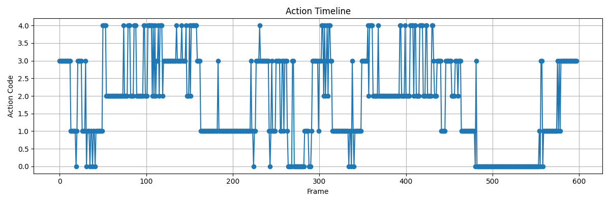
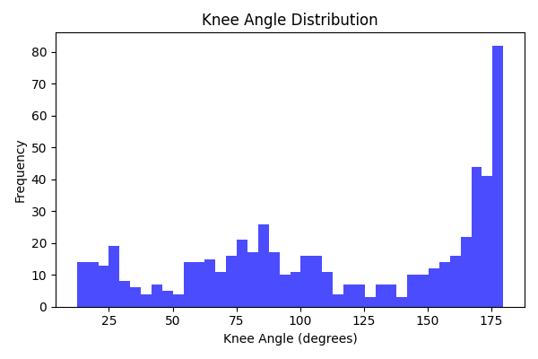

# YOLOv8 Human Posture Detection

This project uses **YOLOv8** to classify and detect four specific human postures in real-time. It is designed to monitor physical activity and safety by identifying transitions between standing, walking, sitting, and kneeling.

##  Detected Classes
The model is trained to recognize:
1. **Standing**: Upright stationary posture.
2. **Walking**: Active movement in an upright position.
3. **Sitting**: Resting on a chair or surface.
4. **Kneeling**: One or both knees touching the ground.

##  Project Results
Here are the performance metrics and movement analysis generated by the model:


*Figure 1: Timeline showing detected actions over a recorded session.*


*Figure 2: Distribution of joint angles used to differentiate sitting vs. kneeling.*

##  Installation & Usage
To run this project locally:

1. Clone the repository:
   ```bash
   git clone [https://github.com/MsibiSandziso/yolo-posture-detection.git](https://github.com/MsibiSandziso/yolo-posture-detection.git)
